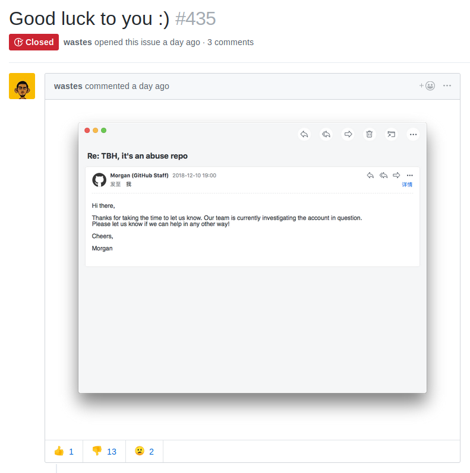

+++
title = "the [E]nd of eeeee"
date = 2018-12-11
+++

_(This is a follow-up to "[A tale of 132 e's](/blog/e98e/)". Post updated to reflect permanent archive location.)_

I archived [e30e/e98e](https://github.com/eeeeeeeeeeeeeeeeeeeeeeeeeeeeeeee/eeeeeeeeeeeeeeeeeeeeeeeeeeeeeeeeeeeeeeeeeeeeeeeeeeeeeeeeeeeeeeeeeeeeeeeeeeeeeeeeeeeeeeeeeeeeeeeeeeee), effectively making it read-only.

This was a decision I made this morning after reading [GitHub Support's first response](github-email-1.txt), regardless of how they continued to respond. I informed the other maintainers of my decision about two hours ago.

I became incredibly disillusioned not just with how GitHub handled the situation, but with the negative responses I received (detailed in [the previous post](../e98e/)).

GitHub initially disabled access to the repository at around 2018-12-10 20:30 UTC and informed me via an automated email, and it took them 19 hours to respond for any clarification whatsoever, writing that the repository "_was disabled following reports of abuse of GitHub’s Terms of Service. Keep in mind, people use GitHub to learn, to work, and to be productive. Generating disruptive content on GitHub can go against our prohibition against spam._"

Please keep your e's to a minimum, folks, there are people trying to perform capitalism here.

A few hours later, [GitHub clarified its concerns](github-email-2.txt), stating that the reason for disabling the repository was that it affected "the UI of other GitHub users who haven’t starred or otherwise interacted with the repository", excluding the Explore page and its related emails, and that it had generated an unsustainable level of support load.

I understand this, and made it clear that I was willing to rename the repository if they could clarify what their limit (even if temporary) actually was. I had no intention of playing chicken with GitHub Support over the number of e's I was allowed to use.

They finally clarified it:

> [_We'd ask that you limit the organization and repository names to 10 characters each for now._](github-email-3.txt)

This is absurd. It took me [approximately five seconds to find a legitimate repository that fails this limit](https://github.com/rust-lang-nursery/edition-guide).

But none of that matters, and there's nothing GitHub Support can or should do at this point. There's a loud minority of GitHub users that really believe that GitHub is not a venue for this kind of activity, and they're willing to show their face to us as they tell us to go fuck ourselves.

[](https://github.com/eeeeeeeeeeeeeeeeeeeeeeeeeeeeeeee/eeeeeeeeeeeeeeeeeeeeeeeeeeeeeeeeeeeeeeeeeeeeeeeeeeeeeeeeeeeeeeeeeeeeeeeeeeeeeeeeeeeeeeeeeeeeeeeeeeee/issues/435)

And despite the tone with GitHub Support improving, and despite us shortening the repo name or the UI fixes they can make, there will still be this loud group of assholes who want to see this wonderful accidental art project gone.

I don't have the energy to maintain a repository that's this popular, and I don't have the energy to do it knowing that at any time GitHub might bend to the whim of a hater and it'll take me an entire day to get the repository back.

[A repository archive is available as a zip file](https://buttslol.net/eeeeeeeeeeeeeeeeeeeeeeeeeeeeeeeeeeeeeeeeeeeeeeeeeeeeeeeeeeeeeeeeeeeeeeeeeeeeeeeeeeeeeeeeeeeeeeeeeeee.git.zip) ([signed checksum file](e98e-sha512sum.txt)), which contains the default branch, all PRs (regardless of state), and a snapshot of accessible forks. It can also be cloned:

```
git clone -b eeeeeeeeeeeeeeeeeeeeeeee https://buttslol.net/eeeeeeeeeeeeeeeeeeeeeeeeeeeeeeeeeeeeeeeeeeeeeeeeeeeeeeeeeeeeeeeeeeeeeeeeeeeeeeeeeeeeeeeeeeeeeeeeeeee.git
```

[ArchiveBot](https://www.archiveteam.org/index.php?title=ArchiveBot) was summoned to take care of capturing the web part, and it'll go to the Internet Archive in due time. Sorry if we didn't merge or respond to your pull request.

If GitHub wants to rename the repository to something shorter, they can. I won't comply with an excessively restrictive demand. [My final email to support explains our position and our concerns.](github-email-4.txt)

I want to thank everybody who contributed to make e98e what it is today. It's been a fun few days. But it's time to move on.
