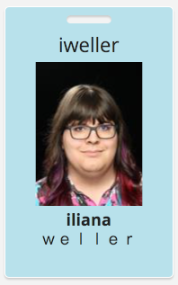
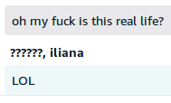

+++
title = "Fitting rooms, but for your name"
date = 2019-08-15
+++

At Amazon, the company directory ("Phone Tool") allows you to set your name to pretty much anything you please. I remember getting the company-wide email sent announcing this ability. A few of my coworkers wondered why anybody would need such a feature. For me, I read that email and realized that functionality was for people like me.

At the time I was playing around with the idea that I might be trans. Idly thinking about femme names in the shower every morning, wondering when I was going to say "fuck it" and shave off my awful beard. That email was when I finally realized that, yeah, I could actually go through with this and come out okay, because there are people out there like me who are looking out for me.

A company directory where you can change your name whenever you want, without the court order and lengthy lines at the Social Security Administration, was so incredibly transformative to me when I came out. I changed my name in the directory, and a couple hours later was able to get a spiffy new badge with my spiffy new name.

And then, a year and a half later, I finally realized that I can have _any name I want_ at work without The Process, and I can _try them on_ for as long as I like.

I went through a lot of different names (I'll get to that below), trying to feel out if anything really felt like "me". About a year ago I ended up changing it out to "iliana destroyer of worlds", during a time when I was changing the last name every few weeks. I couldn't bring myself to change it again because I liked it too damn much.

I started making Git commits with that name, then I changed my email signature to that name, and then I changed my personal website to that name. I tried on the name for a bit and I liked it so much that I still think about getting a legal name change for it despite [being aware of the multitude of systems it would break][name-falsehoods]. (It won't even fit on most credit cards, since I'd refuse to make any of it the middle name.)

[name-falsehoods]: https://www.kalzumeus.com/2010/06/17/falsehoods-programmers-believe-about-names/

I'd like to see, within my lifetime, more ways for folx to try on new names and have that be as far reaching as they like. Real name policies must be destroyed as soon as possible, and not just on Facebook, but everywhere. Payment cards shouldn't have names, but if they must, we need to be able to put anything we like in that field and have it update without shipping a new card. As long as I establish the link between myself and the name, I should be able to have as many names as I want and still be able to file my tax return.

All these things are possible. It is policy, law, and cisnormativity that prevents it. Let's fix that.

By the way: you don't have to be trans to change your name to whatever you like.

## Epilogue: A brief history of iliana's last names

I'll admit, I spent a good while trying to break things with Phone Tool's preferred name field, and ended up learning a lot about how names are distributed across the company.

Emoji are sadly not allowed (not even symbols later retconned as emoji). But [fullwidth forms][fullwidth] are.

[fullwidth]: https://en.wikipedia.org/wiki/Halfwidth_and_fullwidth_forms

I then learned about the many ways where applications get people's names. For Amazon users, [Chime uses Active Directory](https://docs.aws.amazon.com/chime/latest/ag/active_directory.html), and whatever syncs names from Phone Tool to AD has some interesting conversion logic.

After spending some time trying to figure out if there was a way around HTML tag stripping (because who wouldn't want `` as their last name), I decided to go with "iliana weller\';DROP TABLE users;\-\-", until someone with the wrong kind of mind for security (three weeks later) emailed my director. (The single quote was specifically selected because there are plenty of people with apostrophes in their names, and the load bearing symbols didn't even make it through AD conversion.)

After that was "iliana :)", which Active Directory kindly transformed to "), iliana". And then, "iliana destroyer of worlds".
