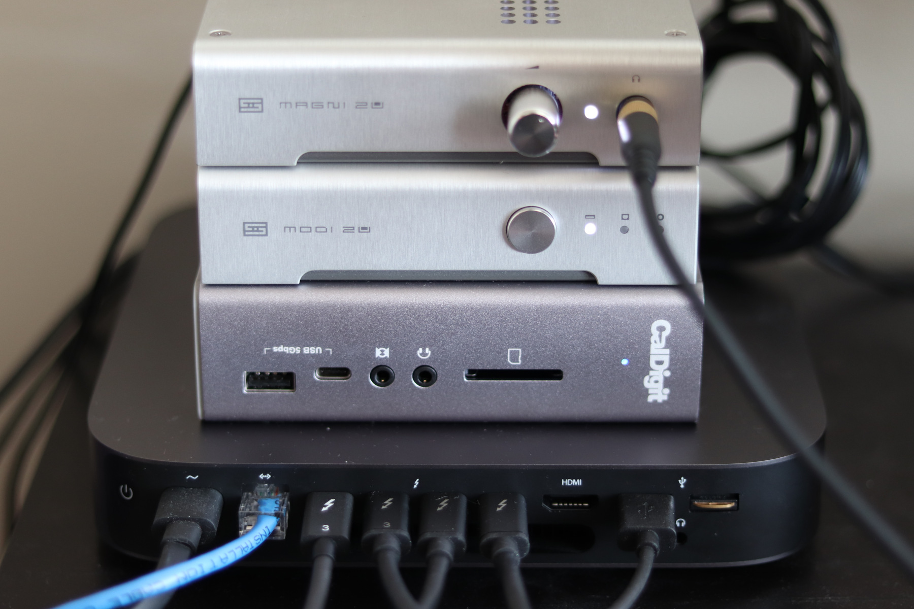
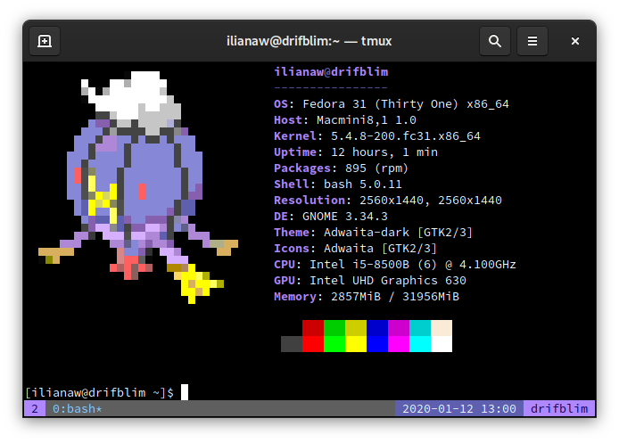

+++
title = "Installing Fedora 31 on a 2018 Mac mini"
date = 2020-01-12T12:00:00-08:00
+++

Within the last couple of years I decided to ditch my 2U rackmount desktop (named `g2-2xlarge`, complete with a GPU on a PCIe riser card) in favor of taking up less space in my house with computers.

I started looking at the mini PC market about four days before the new Mac mini was announced and it just blew me away. Four Thunderbolt 3 ports!

Of course, getting Linux running on new Mac hardware is fraught with peril; this time even more so.

## Hardware support in Linux 5.4

My goal was to get Fedora stable packages booting on my Mac mini (no matter how they had to be installed), with the internal SSD and Thunderbolt ports working, and thermal management working enough to not halt or catch fire.

The T2 Security Chip implements a lot of functionality for modern Macs, including what appears to be a software NVMe controller with some interesting quirks. [The T2 nvme-pci patchset from Benjamin Herrenschmidt](https://lore.kernel.org/linux-nvme/20190807075122.6247-1-benh@kernel.crashing.org/) landed in Linux 5.4.

A patch to [fix a Thunderbolt code path on Titan Ridge hardware](https://git.kernel.org/pub/scm/linux/kernel/git/torvalds/linux.git/commit/?id=0d53827d7c172f1345140f7638fe658bda1bb25d) was also necessary to get Thunderbolt devices showing up on the system.

A few months back, I tried the first Fedora Rawhide compose with these patchsets and confirmed everything worked as expected. I wasn't inclined to run Rawhide on my desktop though, and waited for Linux 5.4 to make its way into a stable Fedora repository. On 6 January 2020, v5.4.7 was in Fedora 31 stable.

## Installation process

Since the Mac mini was sitting on a shelf for several months, I decided to make sure all its firmware was up-to-date by running the macOS Software Update until it told me there weren't anymore. After that I entered [macOS Recovery](https://support.apple.com/en-us/HT201314) to [disable Secure Boot and enable External Boot](https://support.apple.com/en-us/HT208330).

The Fedora 31 netinst ISO doesn't have Linux 5.4, so I opted to install using a Fedora Rawhide network installer. It's possible to install prior versions of Fedora with Anaconda by overriding the repository URLs. `dd` the ISO to a USB drive and boot it by holding down <kbd class="key">⌥&nbsp;Option</kbd>/<kbd class="key">Alt</kbd>, then selecting the orange disk labeled "EFI Boot".

After performing some failed installations and doing some research, I found out about two additional quirks. The first: attempting to add a new boot entry via `efibootmgr` will immediately display an `invalid opcode` message from the kernel and hang the system. A workaround is adding `efi=noruntime` to the kernel command line in both Anaconda and the installed system.

The second: the EFI system partition must be FAT32, which is normally not weird, except that this is a change from past Mac EFI hardware. Working around this is best done with a quick-and-dirty Anaconda patch, distributed via an updates.img. (Note that this patch may cause problems if trying to dual-boot.) This patch applies to the [`anaconda-32.18-1`](https://github.com/rhinstaller/anaconda/tree/anaconda-32.18-1) tag:

```diff
diff --git a/pyanaconda/bootloader/efi.py b/pyanaconda/bootloader/efi.py
index f8dd84a4f..30bee3756 100644
--- a/pyanaconda/bootloader/efi.py
+++ b/pyanaconda/bootloader/efi.py
@@ -197,10 +197,6 @@ class MacEFIGRUB(EFIGRUB):
     def is_valid_stage1_device(self, device, early=False):
         valid = super().is_valid_stage1_device(device, early)

-        # Make sure we don't pick the OSX root partition
-        if valid and getattr(device.format, "name", "") != "Linux HFS+ ESP":
-            valid = False
-
         if hasattr(device.format, "name"):
             log.debug("device.format.name is '%s'", device.format.name)

diff --git a/pyanaconda/platform.py b/pyanaconda/platform.py
index 60db687ad..d9968a860 100644
--- a/pyanaconda/platform.py
+++ b/pyanaconda/platform.py
@@ -162,21 +162,12 @@ class EFI(Platform):


 class MacEFI(EFI):
-    _boot_stage1_format_types = ["macefi"]
-    _boot_efi_description = N_("Apple EFI Boot Partition")
     _non_linux_format_types = ["macefi"]
     _packages = ["mactel-boot"]
     _boot_stage1_missing_error = N_("For a UEFI installation, you must include "
                                     "a Linux HFS+ ESP on a GPT-formatted "
                                     "disk, mounted at /boot/efi.")

-    def set_platform_bootloader_reqs(self):
-        ret = super().set_platform_bootloader_reqs()
-        ret.append(PartSpec(mountpoint="/boot/efi", fstype="macefi",
-                            size=Size("200MiB"), max_size=Size("600MiB"),
-                            grow=True))
-        return ret
-

 class Aarch64EFI(EFI):
     _non_linux_format_types = ["vfat", "ntfs"]
```

Building updates.img is done simply by running `scripts/makeupdates`. Upload it to a web server and add `inst.updates=https://...` to the kernel command line.

For me, <kbd class="key">Ctrl</kbd>+<kbd class="key">X</kbd> did not boot from the boot arguments editor, but <kbd class="key">F10</kbd> did.

With these two workarounds combined, the install proceeds normally, except a prompt about being unable to add the boot entry (which can be answered "Yes" to continue).

If Fedora is the only OS on the machine, there's no need to add a boot entry. If dual-booting, it might be possible to [add an entry with the EFI shell's `bcfg` command](https://wiki.archlinux.org/index.php/Unified_Extensible_Firmware_Interface#bcfg).

## Success!

Say hello to `drifblim`, my new desktop machine:



Apart from adding `efi=noruntime` to the kernel command line, and a rare issue where the system will freeze and halt during boot (then come up fine the next time), this machine is wonderful. It's very quiet at high temperatures compared to what it replaced (an Intel NUC8i5BEK) and seems to perform much better too.



Special thanks to [mikeeq/mbp-fedora](https://github.com/mikeeq/mbp-fedora); while I didn't use that version of the Live CD as it did a lot more than I needed, the information about the above quirks was the help I needed to get this done, and readers might find it useful for installing Fedora on a modern MacBook Pro.
