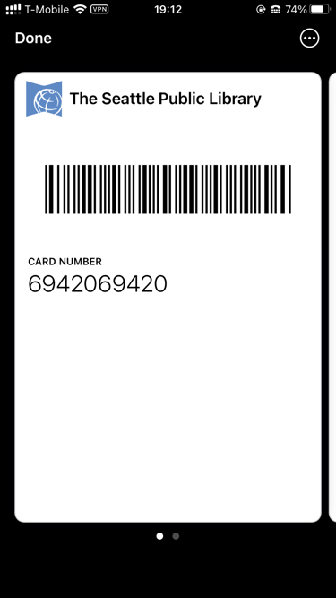

Our local libraries, The Seattle Public Library and the King County Library System, issue pieces of plastic with barcodes printed on the back assigned to your borrower account. These cards are not _strictly_ necessary in 2023; most everything at Seattle libraries is self-service, including circulation, and these self-service entrypoints usually have a way to type in a library barcode manually. But having the barcode is far more convenient, and I'd like to have it without having to keep yet another plastic card I rarely use in my wallet.

So I put it on my phone, in my iPhone's Wallet app. This became extremely silly extremely quickly, so I've decided to document it here for myself and others.

## A brief introduction to passes

The Wallet app can manage many things: payment cards, government/employee/student IDs, house/car/hotel room keys; none of these were part of what Wallet, initially called Passbook, could do at its 2012 launch. At that time, Passbook only managed "passes".

[Apple's documentation on passes](https://developer.apple.com/library/archive/documentation/UserExperience/Conceptual/PassKit_PG/index.html) covers this in more detail, but they are self-contained zip files full of JSON and PNGs designed to be distributed through email or the web from a vendor to its user. If you have a pass on your phone, you can usually go to Pass Details and find a share icon in the top right, allowing you to send the .pkpass file to somewhere you can unzip it and inspect it.

The contents are pretty simple. [There's a specific list of supported images](https://developer.apple.com/library/archive/documentation/UserExperience/Conceptual/PassKit_PG/Creating.html#//apple_ref/doc/uid/TP40012195-CH4-SW52), there's a `pass.json` file which describes all of the non-image content of the pass, there's a `manifest.json` file which lists the SHA-1 checksum of all the other files, and a `signature` which is an S/MIME signature of the contents of the `manifest.json`.

Our first interesting problem is one of barcode formats. Passes support four types of barcodes: [QR code](https://en.wikipedia.org/wiki/QR_code), [PDF417](https://en.wikipedia.org/wiki/PDF417) (commonly used on United States driver licenses), [Aztec Code](https://en.wikipedia.org/wiki/Aztec_Code) (used for boarding passes by the airline industry), and [Code 128](https://en.wikipedia.org/wiki/Code_128) (the only supported linear symbology). My library card uses... _[stares at Wikipedia for half an hour]_ [Codabar](https://en.wikipedia.org/wiki/Codabar), widely used in libraries[^blood], and perhaps one of the cutest barcode symbologies (and names) I've ever seen. It's possible that the barcode scanners at the library support other linear symbologies, but Codabar is the only one I know guaranteed to work at all of them. So we will need to fake it by providing some image that functions as a scannable barcode.

[^blood]: And blood banks?

Our second interesting problem, which is a much worse, "oh no"-level problem: for some reason, passes are cryptographically signed, and they have to be signed with a key known to one of Apple's certificate authorities. Cryptographically signing these files makes some sense when you consider that passes were designed to get automatic updates from their vendors; for example, your boarding pass for a flight reflecting gate changes or changing your seat assignment.

If you are already an Apple developer you can get yourself a pass signing key pretty trivially, but I am not, and I do not intend to drop $99 on this.

## Perfection is the enemy of something or other

There are other people who are already Apple developers who have made various apps for designing passes. They are... passable? Unfortunately I am a perfectionist.

For one thing, there is the matter of the logo in the top left of the pass. Apple has designed this somewhat flexibly, with a maximum height of 50 device-independent pixels, but a square logo with text to the right side is going to most comfortably fit at about 40 pixels tall. Pass developers are expected to provide correctly-sized logos at `logo.png`, `logo@2x.png`, `logo@3x.png`[^1] for different device pixel ratios, but these apps tend to let you select a single logo and not give you any control over how it's scaled. If you give it a 40-pixel image, it'll be blurry on any currently-supported iPhone; if you give it an 80-pixel image, it'll be too large. Not great!

[^1]: `@3x` was news to me! Apparently some newer phones have a 3&times; ratio now.

For another thing, I'd really like to have the screen be brighter as I open the pass. Passes with normal, supported barcodes do this to support scanners that need better contrast. To me, the ideal situation here is to trick iOS into making the screen brighter without actually having a non-functional barcode present. I'm not going to be able to get away with this kind of JSON fuzzing without digging into the JSON myself.

And, these apps tend to be free to download, but only let you save a limited number of passes to Wallet before asking you to pay up. I am not here to judge the developers for doing this but I am probably also not going to pay for your app unless it does what I want it to (and unfortunately what I want is kind of extreme).

## Finding a key

Well, I did just download half a dozen free-to-start pass generator apps.

You could make these one of two ways. Probably the "correct" way is to have some web service which performs the signing, so that you don't ship a private key with the application itself. But surely one of these apps I've downloaded lets you generate passes offline? Sometimes you want the app to work without having to also maintain a web service; that sounds like a one-way ticket to dealing with a ton of bad reviews and refunds when it inevitably goes down.

I turned on Airplane Mode, turned off WiFi, and tried them all. Sure enough, at least one does. I'm not going to draw attention to the specific app I used in this post because I don't want their key to get revoked[^2]. But it was kind of funny how simple the process was:

[^2]: Given that most of these kinds of apps do not make the passes updatable via the internet, that these keys are limited to signing passes, and that the keys are specifically used in "make whatever pass you want" apps, I do not think there's any reason to revoke the key I found. Unfortunately I do not trust Apple will accept this reasoning.

1. Download the app on my Mac, since Apple silicon Macs let you run iOS apps.
2. In the wrapped iOS app bundle, observe that there is a very obvious `.p12` file.
3. Run `strings` on the main binary and look for anything that might be a password (as PKCS#12 files require an import password).

And, well:

```
$ openssl pkcs12 -info -in [redacted].p12 -legacy -nodes
Enter Import Password:
MAC: sha1, Iteration 1
MAC length: 20, salt length: 8
PKCS7 Encrypted data: pbeWithSHA1And40BitRC2-CBC, Iteration 2048
Certificate bag
Bag Attributes
    friendlyName: Pass Type ID: [redacted]
    localKeyID: [redacted]
subject=UID = [redacted], CN = Pass Type ID: [redacted], OU = [redacted], O = [redacted], C = [redacted]
issuer=CN = Apple Worldwide Developer Relations Certification Authority, OU = G4, O = Apple Inc., C = US
...
```

We also need a certificate chain; this certificate is signed with an intermediate. The app needs it too, so it's probably somewhere in the bundle, but the certificate contains within its X.509 extension fields the URL to download the intermediate if you need it (you can view a certificate's various fields with `openssl x509 -noout -text -in whatever.pem`).

## Laying out the pass

First we need to pick a [pass style](https://developer.apple.com/library/archive/documentation/UserExperience/Conceptual/PassKit_PG/Creating.html#//apple_ref/doc/uid/TP40012195-CH4-SW45) out of "boarding pass", "coupon", "event ticket", "generic", or "store card". We want a layout that lets us put a large horizontal image across the pass somewhere. This limits us to layouts that support the "strip" image: coupon, event ticket, or store card. Out of these three, the store card is most skeuomorphic to our physical library card.

Let's type up the start of a `pass.json`. The documentation for this file is found at the [PassKit Package Format Reference](https://developer.apple.com/library/archive/documentation/UserExperience/Reference/PassKit_Bundle/Chapters/Introduction.html).

```json
{
  "passTypeIdentifier": "[redacted]",
  "teamIdentifier": "[redacted]",
  "formatVersion": 1,
  "serialNumber": "whatever",
  "organizationName": "me!",
  "logoText": "The Seattle Public Library",
  "description": "Library Card",
  "storeCard": {
    "headerFields": [],
    "primaryFields": [],
    "backFields": [],
    "secondaryFields": [],
    "auxiliaryFields": []
  },
  "backgroundColor": "rgb(255, 255, 255)",
  "foregroundColor": "rgb(0, 0, 0)",
  "sharingProhibited": false
}
```

The `passTypeIdentifier` and `teamIdentifier` must match the `UID` and `OU` fields, respectively, of the certificate subject you got from Apple and/or found lying around. `serialNumber` needs to be unique for each pass you generate with the same `passTypeIdentifier`. `organizationName` is ostensibly supposed to be who made and signed the pass, but if you're never distributing the pass then it probably doesn't matter.

Now for some images. `icon.png` is required but is not shown on the pass itself. `logo.png` is the logo displayed at the top left. I generated three logo files: a 40&times;40 `logo.png`, an 80&times;80 `logo@2x.png`, and a 120&times;120 `logo@3x.png`; then I copied `logo@3x.png` to `icon.png`.

Finally, we'll need the `strip.png`, which will contain our pre-generated barcode.

## Generating the barcode

Fortunately iOS scales and crops the `strip.png` we generate to fit whatever size box it is on a device, so we don't need to worry about making three different versions of it.

Both my library cards use "A" and "D" as the start and stop symbols. If you already have a barcode scanner handy this is the easiest way to figure out what your start and stop symbols are, but you can also compare the beginning and end of the barcode against [the symbology table on Wikipedia](https://en.wikipedia.org/wiki/Codabar#Encoding) by eye pretty easily.

There aren't many ready-to-use Codabar generators online, but the format is pretty simple to implement yourself. While prototyping I used [the Barcoders library for Rust](https://lib.rs/crates/barcoders) to generate an SVG, then tweaked the SVG and exported a PNG. After some experimentation I settled on the following layout (where 1 unit is the width of a narrow bar):

- The barcode height is, in units, twice the number of total symbols (including the start and stop symbols) in the barcode. (For example: a 13-digit barcode number is 15 symbols, and so I made my barcode height 30 units tall.)
- 15 units of quiet space is placed before the start and after the end of the barcode. (Various reader documentation I've seen suggests 10 units is sufficient but I had a harder time scanning it with my fancy 2D barcode scanner.)
- 50 units of padding are placed above and below the barcode. This is overkill, but helps ensure the image is cropped on the top and bottom, not on the left and right.
- Each unit is scaled up to 8 pixels to ensure iOS is always scaling the image down. (This makes the final image size 1040 pixels tall and, for my example 15-symbol barcode, the barcode 240 pixels tall.)

Codabar has such a simple encoding that I felt an overwhelming urge to write a 69-line shell script that generates a bitmap of an encoded Codabar barcode in the above layout:

```bash
#!/usr/bin/env bash
if [[ $# -ne 2 ]]; then
    >&2 echo "usage: $0 BARCODE OUTPUT"; exit 1
fi

scale_factor=8  # needs to be multiple of 4 for BMP reasons
quiet_space=15
vert_padding=50

draw_black() { head -c $(($1 * scale_factor * 3)) /dev/zero; }
draw_white() { draw_black "$1" | LANG=C tr '\0' '\377'; }
encode_long() {
    for __x in 0 8 16 24; do
        echo -en "\x$(printf %x $((($1 >> __x) % 256)))"
    done
}

workdir=$(mktemp -d)
trap 'rm -rf "$workdir"' EXIT

{
    draw_white $quiet_space
    echo -n "$1" | while read -r -N1 symbol; do
        case $symbol in
            0|2|6|C|\*|B|N|.) bars=0001 ;;&
            1|-|7|D|E|/)      bars=0010 ;;&
            4|$|8|A|T|:)      bars=0100 ;;&
            5|9|3|+)          bars=1000 ;;&
            0|1|4|5)          spaces=001 ;;
            2|-|$|9)          spaces=010 ;;
            6|7|8|3)          spaces=100 ;;
            C|\*|D|E|A|T)     spaces=011 ;;
            B|N)              spaces=110 ;;
            .|/|:|+)          spaces=000 ;;
            *) >&2 echo "$0: warning: ignoring symbol $symbol"; continue ;;
        esac
        for i in {0..3}; do
            draw_black $((${bars:$i:1} + 1))
            draw_white $((${spaces:$i:1} + 1))
        done
    done
    draw_white $((quiet_space - 1))
} >"$workdir/line"

image_width=$(($(wc -c <"$workdir/line") / 3))
barcode_height=$((${#1} * 2))
image_height=$(((barcode_height + vert_padding * 2) * scale_factor))

{
    # BMP header
    printf 'BM'
    encode_long $((image_width * image_height * 3 + 54))
    printf '\0\0\0\0\x36\0\0\0\x28\0\0\0'
    encode_long $image_width
    encode_long $image_height
    printf '\x01\0\x18\0\0\0\0\0'
    encode_long $((image_width * image_height * 3))
    head -c 16 /dev/zero

    draw_white $((image_width * vert_padding))  # top vertical padding

    lines=$((barcode_height * scale_factor))
    while ((lines-- > 0)); do cat "$workdir/line"; done

    draw_white $((image_width * vert_padding))  # bottom vertical padding
} >"$workdir/barcode.bmp"

# if not on macOS, replace with your image conversion tool of choice
sips -s format png "$workdir/barcode.bmp" --out "$2"
```

Writing this script's output to `strip.png` is all we need.

## Adding the barcode number

I also wanted the barcode number to display under the barcode; this is simple enough to do with the secondary fields:

```json
    "secondaryFields": [
      {
        "key": "number",
        "label": "CARD NUMBER",
        "value": "6942069420"
      }
    ],
```

## Faking the barcode UX the rest of the way

When a user selects a barcoded pass, the phone screen gets brighter to assist with scanners. iOS doesn't think we have a barcode yet. I hoped that specifying an _empty_ barcode would do the trick, and... yeah! It does! Specifying this in the top level keys of `pass.json` works:

```json
  "barcodes": [
    {
      "message": "",
      "format": "PKBarcodeFormatCode128",
      "messageEncoding": "iso-8859-1"
    }
  ],
```

It's the perfect workaround: no barcode is displayed at the bottom of the pass, but the phone acts like there's a barcode present.

## Signing and packaging the pass

Once all our files are in place, we need to generate the `manifest.json`, which is an object with filenames as keys and SHA-1 checksums as values. I wrote a terrifying jq filter to generate the manifest for me:

```bash
sha1sum *.png pass.json | \
    jq -Rs 'split("\n") | [ .[] | select(. != "") | split("  ") | {(.[1]): .[0]} ] | add'
```

Now we need to sign the manifest, placing the signature at `signature`. This is done with the `openssl smime` command.

```bash
openssl smime -binary -sign \
    -signer pkpass.crt -inkey pkpass.key -certfile wwdrg4.pem \
    -in manifest.json -outform der -out signature
```

It's possible to use whatever signing time you like[^3] with the `-attime` option, so if the certificate you got from Apple and/or found lying around is expired, you can still sign with it. The `-attime` option takes a UNIX epoch.

[^3]: [Astute observation, Michael.](https://stackoverflow.com/questions/66989389/consequences-of-the-expiration-of-the-signing-certificate-for-a-already-issued-p/66989932#comment130045743_66989932)

And now, we create a zip!

```bash
zip -r out.pkpass *.png pass.json manifest.json signature
```

macOS comes with a pass previewer tool, so you can open this pass to check that it is valid and mostly looks right. (If it's not valid, look for an error in Console.app.) The previewer isn't 100% accurate, but it does have a button to send it to your phone via iCloud, which is pretty cool. You can also get it onto your phone in whatever manner is convenient.

<figure>



<figcaption>Not my real card number, sadly.</figcaption>
</figure>

I will note that I have not yet tested this pass in a real library yet, but my barcode scanner can read it off my phone just as well as it can read it from my physical plastic card if I turn the screen brightness all the way up (yes, even further than the zero-length barcode workaround causes the screen to get brighter).

## Closing thoughts

I think it's pretty neat that the pass specification has remained pretty much unchanged in a decade. But I wish, like many things within the Apple ecosystem, that this didn't require a $99 USD/year membership to get a certificate in order to sign an otherwise harmless pile of PNGs and JSON. There's a few features you can use in passes that I'm glad require signing, but nothing I did here should require it, and I hope that changes someday.

Also I think Apple should add Codabar support to Wallet. I'm not aware of any library that supports using a digital form of a library card in-person, and I think with some tweaks the platform could support libraries without requiring an audit to ensure every barcode scanner across the system can support Code 128.
